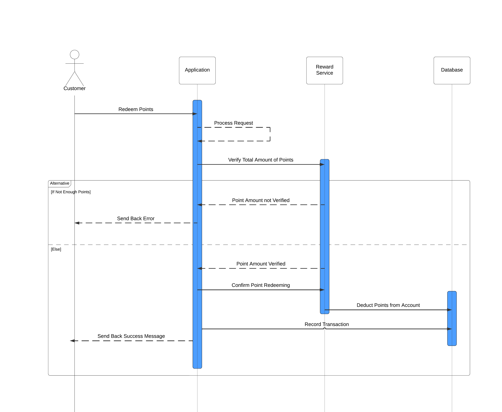

# Central Perk Reward System

## Overview
This project is a reward system for a coffee shop named "Central Perk" to enhance customer engagement by rewarding loyal customers with points for their purchases. The system tracks customer purchases and awards points that can be redeemed for free coffee, snacks, or merchandise.

## Architecture and Design Decisions

### Frontend
- **Framework**: React.js
- **Language**: TypeScript
- **State Management**: Redux Toolkit
- **UI Library**: MaterialUI
- **Testing**: Cypress
- **Design Considerations**: Mobile-first design ensuring the dashboard is responsive and user-friendly on various devices.

### Integration
- REST APIs are integrated into the front end.
- Used https://fakestoreapi.com/ for data presentation.

## Diagrams

### Data Model Diagram
)

### Use Case Diagram


### Class Diagram


### Sequence Diagrams
#### Sequence Diagram 1


#### Sequence Diagram 2


## Running the Application

### Prerequisites
- Node.js

### Frontend Setup
1. **Clone the repository**:
    ```sh
    git clone https://github.com/your-repo/central-perk-frontend.git
    cd central-perk-frontend
    ```

2. **Install dependencies**:
    ```sh
    npm install
    ```

3. **Run the application**:
    ```sh
    npm start
    ```

### Testing
To run the Cypress tests, use the following command:
```sh
npm run cypress:open
